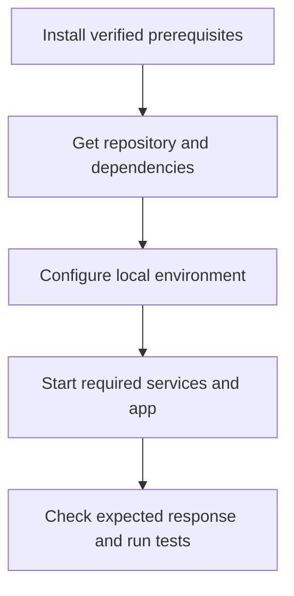

# Tech Stack Setup Guide

> **Starter template, not a verified project guide.** Populate from the actual repository and test each OS path before claiming it works. The [interactive companion](tech-stack-setup.html) is a local static page; keep its steps in sync with this Markdown fallback.

## Start here

**Project:** [name]  
**What you will run:** [one sentence]  
**Estimated time:** [measured estimate or unknown]  
**Supported environments:** Linux [distribution/version], Windows [version + PowerShell/WSL choice], macOS [version/architecture]  
**Verification:** Linux UNVERIFIED · Windows UNVERIFIED · macOS UNVERIFIED

This page teaches someone how to set up and run the project. For system topology and deployment design, use [Architecture and Operations.md](Architecture%20and%20Operations.md). For executed tests and quality evidence, use [Verification and Evaluation.md](Verification%20and%20Evaluation.md). For decisions or pending work, use [Decisions and Handover.md](Decisions%20and%20Handover.md). Do not copy those pages here.

## What you need

| Tool | Why it is needed | Tested version / range | Official install source | Check command |
|---|---|---|---|---|
| [runtime] | [plain-language purpose] | [verified] | [official URL] | `[command]` |
| [package manager] | [purpose] | [verified] | [official URL] | `[command]` |
| [database, if local] | [purpose] | [verified] | [official URL] | `[command]` |

**Before touching secrets:** list required variable *names* and where users obtain them, never values. Keep real credentials in the project's approved secret store or ignored local environment file. Check that example files contain placeholders only.

### Setup at a glance

## Choose your environment

Use the command syntax for your platform. Do not present Unix shell commands as PowerShell equivalents or assume WSL is installed. Replace every bracketed command with a project-tested command before publishing.

| Step | Linux | Windows PowerShell | macOS |
|---|---|---|---|
| Terminal to open | [terminal and version] | [PowerShell version or WSL rationale] | [Terminal and shell] |
| Package installation | [official, verified path] | [official, verified path] | [official, verified path] |
| Environment file | [copy command] | [Copy-Item command] | [copy command] |
| Services | [start command] | [start command] | [start command] |
| Paths and permissions | [important difference] | [important difference] | [important difference] |

## Step-by-step walkthrough

### 1. Check prerequisites

**What this does:** confirms that the runtime and package manager can be found.  
**Linux:** `[verified command]`  
**Windows PowerShell:** `[verified command]`  
**macOS:** `[verified command]`  
**Expected result:** [version or observable output].  
**If it fails:** [diagnostic order and official install link].

**Screenshot slot:** `screenshots/prerequisites-{linux,windows,macos}.png` (PENDING). After verification, embed each real, redacted command and output with descriptive alt text. Do not substitute a mock terminal.

### 2. Get the project and install dependencies

**What this does:** [plain-language explanation of repository and dependency install].  
**Linux:** `[verified command]`  
**Windows PowerShell:** `[verified command]`  
**macOS:** `[verified command]`  
**Expected result:** [files or output].  
**If it fails:** [network, path, permission, lockfile diagnostic order].

**Screenshot slot:** `screenshots/dependencies-{linux,windows,macos}.png` (PENDING). Add redacted real captures and alt text after verification.

### 3. Configure the local environment

| Variable name | Purpose | How to obtain locally | Secret? |
|---|---|---|---|
| [VARIABLE_NAME] | [purpose] | [approved source] | [yes/no] |

**Linux:** `[verified command]`  
**Windows PowerShell:** `[verified command]`  
**macOS:** `[verified command]`  
**Expected result:** [file present, no secret printed]. Never paste a real value into this guide or screenshot.

### 4. Start services and the app

**Linux:** `[verified command]`  
**Windows PowerShell:** `[verified command]`  
**macOS:** `[verified command]`  
**Expected result:** [URL, health response, or CLI output observed locally].  
**Stop/restart:** [verified commands].

**Screenshot slot:** `screenshots/running-{linux,windows,macos}.png` (PENDING). Add redacted real captures and alt text after verification.

### 5. Confirm it works

1. Open [verified local URL] or run `[verified health command]`.
2. Expect [specific visible response].
3. Run `[test command]`, `[lint command]`, and `[build command]` where applicable.
4. Record the observed result and date in [Verification and Evaluation.md](Verification%20and%20Evaluation.md); link it here without copying the test log.

## Troubleshooting

| Symptom | Likely cause to check | Ordered check | Safe recovery |
|---|---|---|---|
| Command not found | Wrong install or PATH | [version → install location → new terminal] | [verified action] |
| Port in use | Another process | [identify process without killing unrelated work] | [configured alternate port or documented stop] |
| Database connection fails | Service, host, or credentials | [service status → config names → logs] | [verified action; no secret exposure] |
| OS-specific failure | [cause] | [first check, then next] | [verified action] |

## Visual checklist and maintenance

| Screenshot | Must show | Capture status |
|---|---|---|
| `screenshots/prerequisites-linux.png`, `-windows.png`, `-macos.png` | real version output | PENDING |
| `screenshots/dependencies-linux.png`, `-windows.png`, `-macos.png` | completed install | PENDING |
| `screenshots/running-linux.png`, `-windows.png`, `-macos.png` | expected local response | PENDING |

Use short captions and meaningful alt text. Crop to the relevant UI, annotate the click or output, redact names, paths, tokens, emails, and private data, and keep image dimensions readable on mobile. If an OS was not tested, keep its commands and screenshot status **UNVERIFIED/PENDING**. Update the companion page and this fallback together when setup changes.
