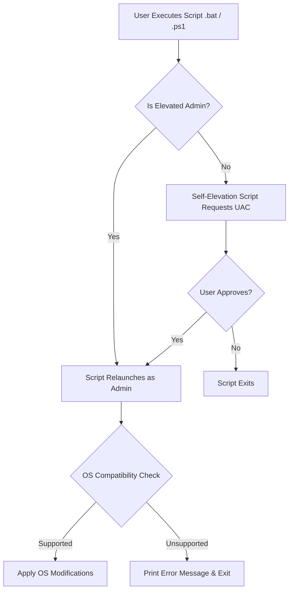

# Tech Stack Setup Guide

This guide provides the necessary information to understand, prepare, and execute the scripts and configurations found in the **Tweaks-Configurations-Troubleshooting** repository.

## 1. Tech Stack List

Since this is a curated knowledge base of system configurations rather than a compiled application, the "tech stack" consists of native OS scripting languages, declarative configuration formats, and standard command-line utilities.

- **Languages & Runtimes:** Windows Batch (`.bat`/`.cmd`), PowerShell (`.ps1`), Windows Registry Script (`.reg`), Bash (Linux/Termux).
- **Key Utilities / Built-ins:**
  - **Windows:** `reg.exe`, `sc.exe`, `compact.exe`, `netsh`, `auditpol`, `dism`, `powercfg`.
  - **Linux / Android (via ADB):** `sysctl`, `systemctl`, `adb`.
- **Package Managers:** None natively required for the repo, though scripts may install software via Winget or apt.
- **Frameworks:** None. 
- **Version Constraints:** Many Windows scripts require Windows 10 (1709+) or Windows 11. Scripts will attempt to detect the OS and exit gracefully if the OS is unsupported.

## 2. Setup Instructions

The repository is a collection of standalone scripts and guides. There is no central build or installation process. You "set up" by choosing the specific tweak or guide you want to apply.

### Windows

1. **Clone or Download:** Download the repository as a ZIP or `git clone` it to a local directory (e.g., `C:\Tweaks`).
2. **Execution Policy (PowerShell):** By default, Windows restricts running PowerShell scripts. Open PowerShell as Administrator and run:
   ```powershell
   Set-ExecutionPolicy RemoteSigned -Scope CurrentUser
   ```
3. **Execution:**
   - **`.bat` / `.cmd`:** Double-click to run. Most scripts include a self-elevation mechanism, so they will prompt for Administrator privileges automatically via UAC.
   - **`.ps1`:** Right-click the file and select "Run with PowerShell".
   - **`.reg`:** Double-click to merge into the registry. You will be prompted by UAC and the Registry Editor to confirm.

### Linux (Debian Based)

1. **Clone or Download:** `git clone` the repository to your home directory.
2. **Execution:**
   - The Linux section primarily consists of `.txt` guides containing command recipes.
   - Open a terminal and manually copy-paste the commands from the guides.
   - Many commands require root privileges and must be prefixed with `sudo`.

### macOS

1. **Applicability:** macOS is not explicitly targeted by the system tweaks in this repository.
2. **Usage:** You can use macOS to read the reference documents (`.pdf`, `.docx`) or to interface with Android devices.
3. **Android Tweaks (via macOS):**
   - Install Android Platform Tools (ADB): `brew install android-platform-tools`
   - Connect your Android device (USB debugging enabled).
   - Use the terminal to run the `adb shell` commands listed in the Android tweaking guides.

## 3. Workflow Visualizations

### Execution Flow for Windows Scripts



### File Type Handling

| File Extension | Content Type | Execution Method | Primary Target |
| :--- | :--- | :--- | :--- |
| **`.bat` / `.cmd`** | Windows Batch Script | Double-click | Windows System State |
| **`.ps1`** | PowerShell Script | Right-click -> Run with PowerShell | Windows System State |
| **`.reg`** | Registry Settings | Double-click (Merge) | Windows Registry |
| **`.json` / `.ini`** | App Configurations | Import via specific application UI | Target Application |
| **`.txt`** | Text Guides / Commands | Manual reading / Copy-paste to terminal | Linux / Android (via ADB) |

## 4. Common Troubleshooting Tips

1. **UAC Elevation Loop:** If a `.bat` file constantly asks for admin rights but never proceeds, ensure the script is located on a local drive (e.g., `C:\`), not a network share where elevation semantics can break.
2. **PowerShell Script execution is disabled:** If you receive an error that running scripts is disabled on this system, you need to update your execution policy (see Windows Setup instructions).
3. **Mojibake (weird characters) in console:** Ensure you do not change the encoding of the batch files. They must remain ASCII/UTF-8 without BOM.
4. **`.reg` file fails to import:** Ensure the `.reg` file (especially `TakeControl.reg` and Windows Update tweaks) is saved with **UTF-16 LE with BOM** encoding. Saving them as UTF-8 will cause Registry Editor to reject them.
5. **Reverting Changes:** Check if an explicit undo script exists (e.g., `Uncompact Windows.bat` or `TakeControl (Revert).reg`). If not, you may need to rely on System Restore points or manually reverse the steps using the provided scripts as a reference.
